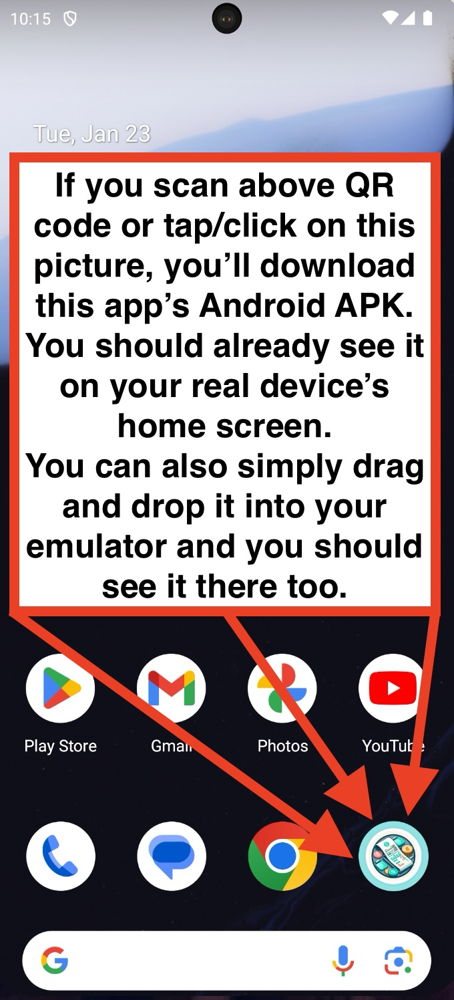

<a name="readme-top"></a>

[![Contributors][contributors-shield]][contributors-url]
[![Forks][forks-shield]][forks-url]
[![Stargazers][stars-shield]][stars-url]
[![Issues][issues-shield]][issues-url]
[![MIT License][license-shield]][license-url]
[![LinkedIn][linkedin-shield]][linkedin-url]

<!-- PROJECT LOGO -->
<br />
<div align="center">
  <a href="https://github.com/MateuszKrolik/RN-EXPENSE-TRACKER">
    
  </a>

<h3 align="center">My Expense Tracker ©</h3>

  <p align="center">
    Cross-Platform Expense Tracker App
    <br />
    <a href="https://github.com/MateuszKrolik/RN-EXPENSE-TRACKER"><strong>Explore the docs »</strong></a>
    <br />
    <br />
    <a href="https://github.com/MateuszKrolik/RN-EXPENSE-TRACKER">View Demo</a>
    ·
    <a href="https://github.com/MateuszKrolik/RN-EXPENSE-TRACKER/issues/new?assignees=&labels=bug&projects=&template=bug-report.md" >Report Bug</a>
    ·
    <a href="https://github.com/MateuszKrolik/RN-EXPENSE-TRACKER/issues/new?assignees=&labels=enhancement&projects=&template=feature-request.md">Request Feature</a>
  </p>
</div>

<!-- TABLE OF CONTENTS -->
<details>
  <summary>Table of Contents</summary>
  <ol>
    <li>
      <a href="#about-the-project">About The Project</a>
      <ul>
        <li><a href="#built-with">Built With</a></li>
      </ul>
    </li>
    <li>
      <a href="#getting-started">Getting Started</a>
      <ul>
        <li><a href="#prerequisites">Prerequisites</a></li>
        <li><a href="#installation">Installation</a></li>
      </ul>
    </li>
    <li><a href="#motivation">Motivation</a></li>
    <li><a href="#usage">Usage</a></li>
    <li><a href="#roadmap">Roadmap</a></li>
    <li><a href="#what-i-learned">What I Learned</a></li>
    <li><a href="#challenges-and-difficulties">Challenges and Difficulties</a></li>
    <li><a href="#contributing">Contributing</a></li>
    <li><a href="#license">License</a></li>
    <li><a href="#contact">Contact</a></li>
    <li><a href="#acknowledgments">Acknowledgments</a></li>
  </ol>
</details>

<!-- ABOUT THE PROJECT -->

## About The Project

<div align="center">
  
[](https://expo.dev////accounts/mateuszkrolik87/projects/RN-EXPENSE-TRACKER/builds/9d5cc42a-1603-45cc-8e2a-b5a1517c2ec7)
[](https://expo.dev////accounts/mateuszkrolik87/projects/RN-EXPENSE-TRACKER/builds/9d5cc42a-1603-45cc-8e2a-b5a1517c2ec7)
[](https://expo.dev/artifacts/eas/t8jbD8SChv29q3J6wt2WB7.tar.gz)
![Product Name Screen Shot][product-screenshot-4]
![Product Name Screen Shot][product-screenshot-5]
![Product Name Screen Shot][product-screenshot-6]
![Product Name Screen Shot][product-screenshot-7]
![Product Name Screen Shot][product-screenshot-8]
![Product Name Screen Shot][product-screenshot-9]
![Product Name Screen Shot][product-screenshot-10]
![Product Name Screen Shot][product-screenshot-11]
![Product Name Screen Shot][product-screenshot-12]
![Product Name Screen Shot][product-screenshot-13]
![Product Name Screen Shot][product-screenshot-14]
![Product Name Screen Shot][product-screenshot-15]
[](https://www.figma.com/file/HGbl3acVwTajtxJSPA0LKw/Expo-App-Icon-%26-Splash-(Community)?type=design&node-id=0%3A1&mode=design&t=flAx8U30VJ7rxKN1-1)

</div>

<p align="right">(<a href="#readme-top">back to top</a>)</p>

### Built With

- [![React Native][react-native-shield]][react-native-url]
- [![Expo][expo-shield]][expo-url]
- [![JavaScript][javascript-shield]][javascript-url]
- [![Node.js][nodejs-shield]][nodejs-url]
- [![npm][npm-shield]][npm-url]
- [![Redux][redux-shield]][redux-url]
- [![Firebase][firebase-shield]][firebase-url]
- [![Firestore][firestore-shield]][firestore-url]
- [![Firebase Auth][firebase-auth-shield]][firebase-auth-url]
- [![EAS][eas-shield]][eas-url]
- [![Unix][unix-shield]][unix-url]
- [![Bash][bash-shield]][bash-url]
- [![Flexbox][flexbox-shield]][flexbox-url]
- [![GCP][gcp-shield]][gcp-url]
- [![Figma][figma-shield]][figma-url]
- [![Axios][axios-shield]][axios-url]
- [![Git][git-shield]][git-url]
- [![Xcode][xcode-shield]][xcode-url]
- [![Android Studio][android-studio-shield]][android-studio-url]
- [![React Navigation][react-navigation-shield]][react-navigation-url]
- [![Babel][babel-shield]][babel-url]
- [![VSCode][vscode-shield]][vscode-url]
- [![Midjourney][midjourney-shield]][midjourney-url]

<p align="right">(<a href="#readme-top">back to top</a>)</p>

<!-- MOTIVATION -->
## Motivation

From a very young age, I've always struggled to keep up with my finances.
With time and rapid technological advancements it only has gotten worse. 
That's why i made this App, for all the people that can relate to my situation!
If you've always struggled to realise your living costs at the end of each week
or even without a specific time boundary, I got you covered!
Simply proceed further to below sections, in order to get yourself up and running ⬇⬇⬇!

<p align="right">(<a href="#readme-top">back to top</a>)</p>


<!-- GETTING STARTED -->
## Getting Started

To get started with this project, you'll need to set up a local development environment and get a Firebase API key.
Follow the steps in below "Prerequisites" and "Installation" sections to get yourself up and running fairly quick ⬇⬇⬇.

<p align="right">(<a href="#readme-top">back to top</a>)</p>

### Prerequisites

Before you can run this project locally, you'll need to have Node.js and npm installed on your machine. 
You can do both with this one command:
1. npm
  ```sh
  npm install npm@latest -g
  ```
2. You'll also need Android Studio and XCode for Mac, but mostly for their emulators.

<p align="right">(<a href="#readme-top">back to top</a>)</p>

### Installation

1. Get a free API Key at [https://firebase.com](https://firebase.com)
2. Clone the repo
   ```sh
   git clone https://github.com/MateuszKrolik/RN-EXPENSE-TRACKER.git
   ```
3. Install NPM packages
   ```sh
   npm install
   ```
4. Enter your API in `.env`
   ```
    FIREBASE_API_KEY = YOUR_FIREBASE_API_KEY
    FIREBASE_AUTH_DOMAIN = YOUR_FIREBASE_AUTH_DOMAIN
    FIREBASE_DATABASE_URL = YOUR_FIREBASE_DATABASE_URL
    FIREBASE_PROJECT_ID = YOUR_FIREBASE_PROJECT_ID
    FIREBASE_STORAGE_BUCKET = YOUR_FIREBASE_STORAGE_BUCKET
    FIREBASE_MESSAGING_SENDER_ID = YOUR_FIREBASE_MESSAGING_SENDER_ID
    FIREBASE_APP_ID = YOUR_FIREBASE_APP_ID
    BACKEND_URL = YOUR_BACKEND_URL
   ```
5. Also in EAS CLI:
   ```sh
    npm install -g eas-cli
    eas login
    eas secret:create FIREBASE_API_KEY "your-firebase-api-key"
    eas secret:create FIREBASE_AUTH_DOMAIN "your-firebase-auth-domain"
    eas secret:create FIREBASE_DATABASE_URL "your-firebase-database-url"
    eas secret:create FIREBASE_PROJECT_ID "your-firebase-project-id"
    eas secret:create FIREBASE_STORAGE_BUCKET "your-firebase-storage-bucket"
    eas secret:create FIREBASE_MESSAGING_SENDER_ID "your-firebase-messaging-sender-id"
    eas secret:create FIREBASE_APP_ID "your-firebase-app-id"
    eas secret:create BACKEND_URL "your-backend-url
   ```
   You will be prompted to choose between string or file, simply choose string and hit ENTER.
7. To run a build:
   ```sh
   eas build:configure
   eas build --platform all
   ```

<p align="right">(<a href="#readme-top">back to top</a>)</p>

<!-- USAGE EXAMPLES -->
## Usage

1. To open using both Android and IOS emulators in development mode run:
   ```sh
   npm start
   a
   i
   ```
2. Or simply drag and drop your builds into your emulators.
3. You can also find these builds attached at the very bottom if you're in a hurry 😉.
4. For Android, you can also scan/tap the QR code at the very top of this readme ⬆⬆⬆.

_For more examples, please refer to the [Documentation](https://example.com)_

<p align="right">(<a href="#readme-top">back to top</a>)</p>


<!-- ROADMAP -->
## Roadmap

- [x] CRUD functionality via Realtime Firestore Database
- [x] HTTP requests via Axios
- [x] Anonymous Authentication via Firebase
    - [x] User Session Persistance across App Reloads
- [x] Shared screen for Managing Expenses
  - [x] Date Placeholders with Numerical Keyboard Trigger
  - [x] Prepopulated form for Update Expense
- [x] Total Summary Counter for both Weekly and Overall Expenses
- [x] User Input validation
    - [x] Date formatting
    - [x] Descriptive Error Messages
- [x] Bottom Tab & Stack Navigation via React Navigation
- [x] App-Wide State Management via Redux Toolkit
    - [x] Component-Wide State Management via Hooks
- [x] Screen Size Adaptiveness
- [x] Styling Adaptiveness for both Platforms
- [x] Responsive Design using FlexBox & Grid
- [x] FlatList Component for Optimized Scroll Item Rendering
- [x] Optimized Splash Screen
- [x] Adaptive App Icon made using Generative AI


See the [open documentation](https://github.com/MateuszKrolik/RN-EXPENSE-TRACKER/issues) for a full list of proposed features (and known issues).

<p align="right">(<a href="#readme-top">back to top</a>)</p>

<!-- WHAT I LEARNED -->
## What I Learned

By making this app I learned a lot about modern UI development. 
Up until this point, as an aspiring "pure" backend developer, 
I only made Multi-Page Applications, that would
trigger full page re-renders upon every request.
That approach was slow to load for the end user.

By choosing to build this app using React and Redux
I realised the benefits of Mobile/Single Page Applications
built using a Reactive, Declarative UI Framework.
I also recognized the importance of App-Wide state management
for One-Way-Data-Flow encouragement and Immutability.

These skills will be directly applicable in my every day life
and future career as a FullStack Web/Mobile Developer! 

I also learned the importance of User Authentication, 
as you'll see shortly in below section ⬇⬇⬇.

<p align="right">(<a href="#readme-top">back to top</a>)</p>

<!-- CHALLENGES AND DIFFICULTIES -->
## Challenges and Difficulties

While making this App, the part that I found the most difficult
was overcoming a deadline of protecting my Realtime Database from being dropped.
I got an e-mail from Firebase stating that if I don't update
database rules to use some sort of User Authentication, then they'll 
drop it completly! Also even when I did, non-logged in users weren't able to write into it.
That meant complete app re-design under a short 4 day time limit!
There was also an issue of User Session Data not persisting upon App Restarts,
but I solved it using Third-Party tools and Libraries. 
You can see the details in below screenshots ⬇⬇⬇.

![Product Name Screen Shot][product-screenshot-17]
![Product Name Screen Shot][product-screenshot-18]
![Product Name Screen Shot][product-screenshot-19]


<p align="right">(<a href="#readme-top">back to top</a>)</p>


<!-- CONTRIBUTING -->

## Contributing

Contributions are what make the open source community such an amazing place to learn, inspire, and create. Any contributions you make are **greatly appreciated**.

If you have a suggestion that would make this better, please fork the repo and create a pull request. You can also simply open an issue with the tag "enhancement".
Don't forget to give the project a star! Thanks again!

1. Fork the Project
2. Create your Feature Branch (`git checkout -b feature/AmazingFeature`)
3. Commit your Changes (`git commit -m 'Add some AmazingFeature'`)
4. Push to the Branch (`git push origin feature/AmazingFeature`)
5. Open a Pull Request

<p align="right">(<a href="#readme-top">back to top</a>)</p>

<!-- LICENSE -->

## License

Distributed under the MIT License. See `LICENSE` for more information.

<p align="right">(<a href="#readme-top">back to top</a>)</p>

<!-- CONTACT -->

## Contact

Mateusz Królik - mateuszkrolik87@gmail.com

Android APK Download Link: [https://expo.dev//accounts/mateuszkrolik87/projects/RN-EXPENSE-TRACKER/builds/9d5cc42a-1603-45cc-8e2a-b5a1517c2ec7](https://expo.dev//accounts/mateuszkrolik87/projects/RN-EXPENSE-TRACKER/builds/9d5cc42a-1603-45cc-8e2a-b5a1517c2ec7)

IOS Simulator Build Download Link: [https://expo.dev/artifacts/eas/t8jbD8SChv29q3J6wt2WB7.tar.gz](https://expo.dev/artifacts/eas/t8jbD8SChv29q3J6wt2WB7.tar.gz)

Project Repository Link: [https://github.com/MateuszKrolik/RN-EXPENSE-TRACKER](https://github.com/MateuszKrolik/RN-EXPENSE-TRACKER)

Figma Icon and Splash Design Link: [https://www.figma.com/file/HGbl3acVwTajtxJSPA0LKw/Expo-App-Icon-%26-Splash-(Community)?type=design&node-id=0%3A1&mode=design&t=flAx8U30VJ7rxKN1-1](https://www.figma.com/file/HGbl3acVwTajtxJSPA0LKw/Expo-App-Icon-%26-Splash-(Community)?type=design&node-id=0%3A1&mode=design&t=flAx8U30VJ7rxKN1-1)

<p align="right">(<a href="#readme-top">back to top</a>)</p>

<!-- ACKNOWLEDGMENTS -->
## Acknowledgments

Use this space to list resources you find helpful and would like to give credit to. I've included a few of my favorites to kick things off!

* [Ionicons](https://ionic.io/ionicons)
* [Img Shields](https://shields.io)
* [Malven's Flexbox Cheatsheet](https://flexbox.malven.co/)
* [Malven's Grid Cheatsheet](https://grid.malven.co/)
* [GitHub Emoji Cheat Sheet](https://www.webpagefx.com/tools/emoji-cheat-sheet)
* [Expo App Icon & Splash Figma Template](https://www.figma.com/community/file/1155362909441341285)

<p align="right">(<a href="#readme-top">back to top</a>)</p>


<!-- MARKDOWN LINKS & IMAGES -->
<!-- https://www.markdownguide.org/basic-syntax/#reference-style-links -->

[contributors-shield]: https://img.shields.io/github/contributors/MateuszKrolik/RN-EXPENSE-TRACKER.svg?style=for-the-badge
[contributors-url]: https://github.com/MateuszKrolik/RN-EXPENSE-TRACKER/graphs/contributors
[forks-shield]: https://img.shields.io/github/forks/MateuszKrolik/RN-EXPENSE-TRACKER.svg?style=for-the-badge
[forks-url]: https://github.com/MateuszKrolik/RN-EXPENSE-TRACKER/network/members
[stars-shield]: https://img.shields.io/github/stars/MateuszKrolik/RN-EXPENSE-TRACKER.svg?style=for-the-badge
[stars-url]: https://github.com/MateuszKrolik/RN-EXPENSE-TRACKER/stargazers
[issues-shield]: https://img.shields.io/github/issues/MateuszKrolik/RN-EXPENSE-TRACKER.svg?style=for-the-badge
[issues-url]: https://github.com/MateuszKrolik/RN-EXPENSE-TRACKER/issues
[license-shield]: https://img.shields.io/github/license/MateuszKrolik/RN-EXPENSE-TRACKER.svg?style=for-the-badge
[license-url]: https://github.com/MateuszKrolik/RN-EXPENSE-TRACKER/blob/master/LICENSE
[linkedin-shield]: https://img.shields.io/badge/-LinkedIn-black.svg?style=for-the-badge&logo=linkedin&colorB=555
[linkedin-url]: https://www.linkedin.com/in/mateusz-kr%C3%B3lik-8b1862262/
[product-screenshot-1]: images/android-apk-qr.png
[product-screenshot-2]: images/android-home-screen.png
[product-screenshot-3]: images/ios-home-screen.png
[product-screenshot-4]: images/splash.png
[product-screenshot-5]: images/android-no-recent-1.png
[product-screenshot-6]: images/ios-no-recent-1.png
[product-screenshot-7]: images/android-add-1.png
[product-screenshot-8]: images/ios-add-1.png
[product-screenshot-9]: images/android-no-recent.png
[product-screenshot-10]: images/ios-no-recent.png
[product-screenshot-11]: images/android-all.png
[product-screenshot-12]: images/ios-all.png
[product-screenshot-13]: images/android-error-handling.png
[product-screenshot-14]: images/ios-error-handling.png
[product-screenshot-15]: images/ios-flatlist-scroll.png
[product-screenshot-16]: images/figma-expo.png
[product-screenshot-17]: images/firebase-mail.png
[product-screenshot-18]: images/firebase-rules.png
[product-screenshot-19]: images/firebase-auth.png


[unix-shield]: https://img.shields.io/badge/Unix-FCC624?style=for-the-badge&logo=linux&logoColor=black
[unix-url]: https://www.unix.com/


[flexbox-shield]: https://img.shields.io/badge/Flexbox-%231572B6.svg?style=for-the-badge&logo=css3&logoColor=white
[flexbox-url]: https://developer.mozilla.org/en-US/docs/Web/CSS/CSS_Flexible_Box_Layout

[react-native-shield]: https://img.shields.io/badge/React_Native-20232A?style=for-the-badge&logo=react&logoColor=61DAFB
[react-native-url]: https://reactnative.dev/
[expo-shield]: https://img.shields.io/badge/Expo-000020?style=for-the-badge&logo=expo&logoColor=white
[expo-url]: https://expo.dev/
[javascript-shield]: https://img.shields.io/badge/JavaScript-F7DF1E?style=for-the-badge&logo=javascript&logoColor=black
[javascript-url]: https://developer.mozilla.org/en-US/docs/Web/JavaScript
[nodejs-shield]: https://img.shields.io/badge/Node.js-43853D?style=for-the-badge&logo=node.js&logoColor=white
[nodejs-url]: https://nodejs.org/
[npm-shield]: https://img.shields.io/badge/npm-CB3837?style=for-the-badge&logo=npm&logoColor=white
[npm-url]: https://www.npmjs.com/

[redux-shield]: https://img.shields.io/badge/Redux-764ABC?style=for-the-badge&logo=redux&logoColor=white
[redux-url]: https://redux.js.org/
[firebase-shield]: https://img.shields.io/badge/Firebase-FFCA28?style=for-the-badge&logo=firebase&logoColor=black
[firebase-url]: https://firebase.google.com/


[firebase-auth-shield]: https://img.shields.io/badge/Firebase_Auth-000020?style=for-the-badge&logo=data:image/svg+xml;base64,PHN2ZyB4bWxucz0iaHR0cDovL3d3dy53My5vcmcvMjAwMC9zdmciIHdpZHRoPSIxOTIiIGhlaWdodD0iMTkyIj4KICA8ZGVmcz4KICAgIDxjbGlwUGF0aCBpZD0iYSI+CiAgICAgIDxjaXJjbGUgY3g9Ijk2IiBjeT0iOTYiIHI9Ijk2IiBmaWxsPSJub25lIi8+CiAgICA8L2NsaXBQYXRoPgogIDwvZGVmcz4KICA8ZyBjbGlwLXBhdGg9InVybCgjYSkiIGZpbGw9Im5vbmUiPgogICAgPHBhdGggZmlsbD0iI2ZmYzEwNyIgZD0iTTAgMGgxOTJ2MTkySDB6Ii8+CiAgICA8cGF0aCBkPSJNMTAxLjc2NSA3MS44NzhsMS4yODktMi4zNzkgMS43MDgtMi4wNyAyLjA3LTEuNzA5IDIuMzc5LTEuMjg5IDIuNjMtLjgxNCAyLjgyNi0uMjg0IDIuODIzLjI4NCAyLjYyNS44MTQgMi4zNyAxLjI5IDIuMDYzIDEuNzA3IDEwMDAgMTAwMCAxLjcgMi4wNzEgMS4yODEgMi4zNzkuODEgMi42My4yODEgMi44MjUtLjI4MiAyLjgyNi0uODA5IDIuNjMtMS4yODEgMi4zNzgtMS43IDIuMDcxLTEuODY2IDEuNTQ2IDIxLjA3NiAyMS4wNzcgMS40OTIgMS41OTQgMS4xMjYgMS43MjEuNzEgMS44NDkuMjQ3IDEuOTc1djExLjY2N2gtMjhsLTkuMzMzLTkuMzM0djkuMzM0aC02NS4zMzNsLTEwMDAtMTAwMFYxMTdsLjI0Ny0xLjk3NS43MS0xLjg0OSAxLjEyNi0xLjcyMSAxLjQ5Mi0xLjU5NCAxLjgxMS0xLjQ2NyAyLjA4My0xLjM0IDIuMzA1LTEuMjEzIDIuNDgyLTEuMDg1IDUuMjk2LTEuNzg4IDUuNDIzLTEuMjc4IDUuMTY2LS43NjcgMi4zNjctLjE5MiAyLjE1OC0uMDY0IDIuMTYuMDY0IDEuNTU0LjEyNi0xMy42MTktMTMuNjE5LTEuNzA4LTIuMDctMS4yODktMi4zNzktLjgxNC0yLjYzLS4yODQtMi44MjYuMjg0LTIuODI1LjgxNC0yLjYzIDEuMjktMi4zNzkgMS43MDctMi4wN0w2OS41IDY1LjcybDIuMzc5LTEuMjg5IDIuNjMtLjgxNCAyLjgyNS0uMjg0IDIuODI0LjI4NCAyLjYyNS44MTQgMi4zNyAxLjI5IDIuMDYzIDEuNzA3IDE0LjE4NiAxNC4xODYtLjQ1LTEuNDU1LS4yODQtMi44MjYuMjg0LTIuODI1eiIgZmlsbD0iI2ZmYjMwMCIvPgogICAgPHBhdGggZD0iTTEwMS43NjUgNzEuODc4bDEuMjg5LTIuMzc5IDEuNzA4LTIuMDcgMi4wNy0xLjcwOSAyLjM3OS0xLjI4OSAyLjYzLS44MTQgMi44MjYtLjI4NCAyLjgyMy4yODQgMi42MjUuODE0IDIuMzcgMS4yOSAyLjA2MyAxLjcwN0wxOTIgMTM0Ljg4VjE5MmgtODRsLTYzLjMzMy02My4zMzNWMTE3bC4yNDctMS45NzUuNzEtMS44NDkgMS4xMjYtMS43MjEgMS40OTItMS41OTQgMS44MTEtMS40NjcgMi4wODMtMS4zNCAyLjMwNS0xLjIxMyAyLjQ4Mi0xLjA4NSA1LjI5Ni0xLjc4OCA1LjQyMy0xLjI3OCA1LjE2Ni0uNzY3IDIuMzY3LS4xOTIgMi4xNTgtLjA2NCAyLjE2LjA2NCAxLjU1NC4xMjYtMTMuNjE5LTEzLjYxOS0xLjcwOC0yLjA3LTEuMjg5LTIuMzgtLjgxNC0yLjYyOS0uMjg0LTIuODI2LjI4NC0yLjgyNS44MTQtMi42MyAxLjI5LTIuMzc5IDEuNzA3LTIuMDdMNjkuNSA2NS43MmwyLjM3OS0xLjI4OSAyLjYzLS44MTQgMi44MjUtLjI4NCAyLjgyNC4yODQgMi42MjUuODE0IDIuMzcgMS4yOSAyLjA2MyAxLjcwNyAxNC4xODYgMTQuMTg2LS40NS0xLjQ1NS0uMjg0LTIuODI2LjI4NC0yLjgyNXoiIGZpbGw9IiNmZmIzMDAiLz4KICAgIDxwYXRoIGQ9Ik0xMTQuNjY3IDkxLjMzM2M3Ljc0NiAwIDEzLjk1My02LjI1MyAxMy45NTMtMTQgMC03Ljc0Ni02LjIwNy0xNC0xMy45NTMtMTQtNy43NDcgMC0xNCA2LjI1NC0xNCAxNCAwIDcuNzQ3IDYuMjUzIDE0IDE0IDE0em0tMzcuMzM0IDBjNy43NDcgMCAxMy45NTQtNi4yNTMgMTMuOTU0LTE0IDAtNy43NDYtNi4yMDctMTQtMTMuOTU0LTE0LTcuNzQ2IDAtMTQgNi4yNTQtMTQgMTQgMCA3Ljc0NyA2LjI1NCAxNCAxNCAxNHptMCA5LjMzNGMtMTAuODczIDAtMzIuNjY2IDUuNDYtMzIuNjY2IDE2LjMzM3YxMS42NjdIMTEwVjExN2MwLTEwLjg3My0yMS43OTMtMTYuMzMzLTMyLjY2Ny0xNi4zMzN6bTM3LjMzNCAwYy0xLjM1NCAwLTIuODk0LjA5My00LjUyNy4yMzMgNS40MTMgMy45MiA5LjE5MyA5LjE5MyA5LjE5MyAxNi4xdjExLjY2N2gyOFYxMTdjMC0xMC44NzMtMjEuNzkzLTE2LjMzMy0zMi42NjYtMTYuMzMzeiIgZmlsbD0iI2ZmZiIgZmlsbC1ydWxlPSJldmVub2RkIi8+CiAgPC9nPgo8L3N2Zz4K&logoColor=white

[firebase-auth-url]: https://firebase.google.com/products/auth


[eas-shield]: https://img.shields.io/badge/EAS-808080?style=for-the-badge&logo=data:image/svg+xml;base64,PD94bWwgdmVyc2lvbj0iMS4wIiBlbmNvZGluZz0idXRmLTgiPz48IS0tIFVwbG9hZGVkIHRvOiBTVkcgUmVwbywgd3d3LnN2Z3JlcG8uY29tLCBHZW5lcmF0b3I6IFNWRyBSZXBvIE1peGVyIFRvb2xzIC0tPgo8c3ZnIHdpZHRoPSI4MDBweCIgaGVpZ2h0PSI4MDBweCIgdmlld0JveD0iMCAwIDMyIDMyIiB4bWxucz0iaHR0cDovL3d3dy53My5vcmcvMjAwMC9zdmciPjx0aXRsZT5maWxlX3R5cGVfbGlnaHRfZXhwbzwvdGl0bGU+PHBhdGggZD0iTTMuOTc5LDIwLjA1OSwxMS4yNTIsNi4ybDcuMTU1LTMuODM1LDIuMTI4LDEuMDc0TDEzLjQyMyw3LjQ1N2w3LjM0OCwyMi4wODhMMTguNDA3LDI4LjE3bC01LjUtMTIuNjc3LTcuMjIsNS40NzlaIiBzdHlsZT0iZmlsbDojZmZmIi8+PGVsbGlwc2UgY3g9IjI1LjI0IiBjeT0iMTMuOTY3IiByeD0iMi42ODYiIHJ5PSIyLjUwMyIgc3R5bGU9ImZpbGw6I2ZmZiIvPjxwYXRoIGQ9Ik0yNy4yLDEyLjg1YTIuNDMyLDIuNDMyLDAsMCwwLTQuMTU3LjMsMi4xODgsMi4xODgsMCwwLDAsLjQxOSwyLjQ0OUEzLjU0NCwzLjU0NCwwLDAsMCwyNy4yLDEyLjg1Wk0xOS45NzYsMy40bC0xLjU0Ny0uODQ5TDExLjY5Myw2LjNsLjUzNy4yOSwxLjAyMS41MzdMMTUuMSw2LjFsNC44NzctMi43MThabS42MjMtLjI1OGEuMjQuMjQsMCwwLDEsLjE3Mi4xNjFMMjMuMDI3LDkuOTZhLjIyMy4yMjMsMCwwLDEtLjEwNy4yOSw0LjM2Miw0LjM2MiwwLDAsMC0yLjEwNiw0Ljk4NSw0LjYwOCw0LjYwOCwwLDAsMCw0LjkyLDMuMjQ0LjI4NS4yODUsMCwwLDEsLjI4LjE3MmwyLjMzMSw2LjgzM2EuMjc3LjI3NywwLDAsMS0uMTA4LjNsLTcuMTY1LDQuMTg5YS4yNjguMjY4LDAsMCwxLS4xMDguMDIyLjI4Ni4yODYsMCwwLDEtLjE5My0uMDMybC0yLjUxNC0xLjU4YS4yNTEuMjUxLDAsMCwxLS4xMDctLjEwN0wxMy4yNCwxNi45ODYsNS43NjMsMjEuMjRhLjM0NS4zNDUsMCwwLDEtLjI5LjAxMWwtMS43LS45NjdhLjI0Ny4yNDcsMCwwLDEtLjEwNy0uMzIyTDEwLjkzLDYuMTc4YS4yNi4yNiwwLDAsMSwuMTE4LS4xMDdsNy4yNDEtNC4wMzlhLjI3NC4yNzQsMCwwLDEsLjI1OCwwWk0xMS42MTgsNi44NDRsLS4zNTUtLjE4Mi03LDEzLjMzMiwxLjI3OC43Miw2LjAzOC03LjlhLjI5NC4yOTQsMCwwLDEsLjI0Ny0uMTA4LjMuMywwLDAsMSwuMjE1LjE2MWw2LjU3NSwxNS4xNDhMMjAuMzczLDI5LjEsMTMuMzE1LDguNDY3bC0uMy0uODYtMS40MDctLjc3M1ptMTAuODI5LDcuOTVhMi43MjcsMi43MjcsMCwwLDEsMS4zNDMtMy4xMTUsMi45NjUsMi45NjUsMCwwLDEsMy40ODEuNDMsMi43MTksMi43MTksMCwwLDEsLjA3OCwzLjg0M2wtLjA3OC4wNzhhMi45MzIsMi45MzIsMCwwLDEtNC44MjQtMS4yMzZaIi8+PC9zdmc+&logoColor=white
[eas-url]: https://expo.dev/services

[gcp-shield]: https://img.shields.io/badge/Google%20Cloud%20Platform-%234285F4.svg?style=for-the-badge&logo=google-cloud&logoColor=white
[gcp-url]: https://cloud.google.com/

[figma-shield]: https://img.shields.io/badge/Figma-%23F24E1E.svg?style=for-the-badge&logo=figma&logoColor=white
[figma-url]: https://www.figma.com/

[axios-shield]: https://img.shields.io/badge/Axios-%2300A8E1.svg?style=for-the-badge&logo=axios&logoColor=white
[axios-url]: https://axios-http.com/

[git-shield]: https://img.shields.io/badge/Git-%23F05033.svg?style=for-the-badge&logo=git&logoColor=white
[git-url]: https://git-scm.com/

[xcode-shield]: https://img.shields.io/badge/Xcode-%23147EFB.svg?style=for-the-badge&logo=xcode&logoColor=white
[xcode-url]: https://developer.apple.com/xcode/

[android-studio-shield]: https://img.shields.io/badge/Android%20Studio-%233DDC84.svg?style=for-the-badge&logo=android-studio&logoColor=white
[android-studio-url]: https://developer.android.com/studio

[babel-shield]: https://img.shields.io/badge/Babel-%23F9DC3E.svg?style=for-the-badge&logo=babel&logoColor=black
[babel-url]: https://babeljs.io/

[bash-shield]: https://img.shields.io/badge/Bash-%234EAA25.svg?style=for-the-badge&logo=gnu-bash&logoColor=white
[bash-url]: https://www.gnu.org/software/bash/


[firestore-shield]: https://img.shields.io/badge/Firestore-800080.svg?style=for-the-badge&logo=data:image/svg+xml;base64,PD94bWwgdmVyc2lvbj0iMS4wIiBlbmNvZGluZz0idXRmLTgiPz4KDTwhLS0gVXBsb2FkZWQgdG86IFNWRyBSZXBvLCB3d3cuc3ZncmVwby5jb20sIEdlbmVyYXRvcjogU1ZHIFJlcG8gTWl4ZXIgVG9vbHMgLS0+Cjxzdmcgd2lkdGg9IjgwMHB4IiBoZWlnaHQ9IjgwMHB4IiB2aWV3Qm94PSIwIDAgMjQgMjQiIHhtbG5zPSJodHRwOi8vd3d3LnczLm9yZy8yMDAwL3N2ZyI+Cg08ZGVmcz4KDTxzdHlsZT4uY2xzLTF7ZmlsbDojNjY5ZGY2O30uY2xzLTJ7ZmlsbDojYWVjYmZhO30uY2xzLTN7ZmlsbDojNDI4NWY0O308L3N0eWxlPgoNPC9kZWZzPgoNPHRpdGxlPkljb25fMjRweF9GaXJlc3RvcmVfQ29sb3I8L3RpdGxlPgoNPGcgZGF0YS1uYW1lPSJQcm9kdWN0IEljb25zIj4KDTxnIGRhdGEtbmFtZT0iY29sb3JlZC0zMi9maXJlc3RvcmUiPgoNPGcgPgoNPHBhdGggY2xhc3M9ImNscy0xIiBkPSJNMjEsMTMsMTIsOXY0bDksNFptMC03TDEyLDJWNmw5LDRaIi8+Cg08cG9seWdvbiBpZD0iUmVjdGFuZ2xlLTciIGNsYXNzPSJjbHMtMiIgcG9pbnRzPSIzIDYgMTIgMiAxMiA2IDMgMTAgMyA2Ii8+Cg08cG9seWdvbiBpZD0iUmVjdGFuZ2xlLTctMiIgZGF0YS1uYW1lPSJSZWN0YW5nbGUtNyIgY2xhc3M9ImNscy0yIiBwb2ludHM9IjMgMTMgMTIgOSAxMiAxMyAzIDE3IDMgMTMiLz4KDTxwb2x5Z29uIGlkPSJSZWN0YW5nbGUtNy0zIiBkYXRhLW5hbWU9IlJlY3RhbmdsZS03IiBjbGFzcz0iY2xzLTMiIHBvaW50cz0iMTIgMTggMTUuMzcgMTYuNSAxOS44OCAxOC41IDEyIDIyIDEyIDE4Ii8+Cg08L2c+Cg08L2c+Cg08L2c+Cg08L3N2Zz4=&logoColor=white
[firestore-url]: https://firebase.google.com/products/firestore

[react-navigation-shield]: https://img.shields.io/badge/React_Navigation-FFFFFF?style=for-the-badge&logo=data:image/svg+xml;base64,PD94bWwgdmVyc2lvbj0iMS4wIiBlbmNvZGluZz0iVVRGLTgiIHN0YW5kYWxvbmU9Im5vIj8+CjwhRE9DVFlQRSBzdmcgUFVCTElDICItLy9XM0MvL0RURCBTVkcgMjAwMTAxMDEvL0VOIiAiaHR0cDovL3d3dy53My5vcmcvVFIvMjAwMS9SRUMtU1ZHLTIwMDEwMTAxL0RURC9zdmcxMC5kdGQiPgo8c3ZnIHdpZHRoPSIyMDAiIGhlaWdodD0iMjAwIiB2aWV3Qm94PSIwIDAgMjAwIDIwMCIgdmVyc2lvbj0iMS4xIiB4bWxucz0iaHR0cDovL3d3dy53My5vcmcvMjAwMC9zdmciIHhtbG5zOnhsaW5rPSJodHRwOi8vd3d3LnczLm9yZy8xOTk5L3hsaW5rIj4KICA8ZyB0cmFuc2Zvcm09InRyYW5zbGF0ZSgwLjAwMDAwMCwyMDAuMDAwMDAwKSBzY2FsZSgwLjEwMDAwMCwtMC4xMDAwMDApIiBmaWxsPSIjMDAwMDAwIiBzdHJva2U9Im5vbmUiPgogICAgPHBhdGggZD0iTTg3NSAxODQwIGMtODQgLTE2IC0xNjUgLTQ4IC0yODAgLTExMiAtMTMyIC03NCAtMTIwIC02NSAtMjE5IC0xNjQKLTk1IC05NCAtMTU0IC0xOTcgLTE4NyAtMzI2IC0zMSAtMTIxIC0zMCAtMzY5IDEgLTQ4MyA0MyAtMTU2IDEzMSAtMjk1IDI0MwotMzgzIDg1IC02NyAyMzcgLTE1MyAzMzIgLTE4OCA3NiAtMjcgODkgLTI5IDI0MCAtMjkgMTk0IDAgMjMzIDExIDQyNyAxMjMKMTIwIDY5IDIxNCAxNDkgMjcwIDIzMCA0MCA1OSA5MiAxNjUgMTE0IDIzNyAxNiA1MCAxOSA5MiAxOSAyNTAgMCAxNzEgLTIgMTk3Ci0yMyAyNjQgLTQ4IDE1MiAtMTM5IDI4NiAtMjU2IDM3NyAtMzMgMzAgLTcyIDU0IC03NyA1NCAtNSAwIC0yOCAxMiAtNTEgMjYKLTE0MyA5MCAtMjQ1IDEyNCAtMzkzIDEyOSAtNjAgMiAtMTMyIDAgLTE2MCAtNXogbTIwMCAtMzkgbDQwIC03IC01NSAtNyBjLTMwCi00IC04MCAtNCAtMTEwIDAgLTQ5IDYgLTUyIDggLTI1IDE0IDQxIDkgMTAyIDkgMTUwIDB6IG0tMjc0IC05MiBjLTI5IC0xNwotNzggLTUxIC0xMDggLTc1IC0yOSAtMjQgLTYyIC00NCAtNzEgLTQ0IC0xMCAwIC0yMiAtNCAtMjcgLTggLTYgLTUgLTI2IC0xNQotNDUgLTIyIC0xOSAtOCAtNTQgLTI3IC03NyAtNDIgLTI0IC0xNiAtNDMgLTI2IC00MyAtMjIgMCAxMiA3NSAxMDAgMTE1IDEzNQoyMiAxOSA0MiAzNyA0NSA0MSAxNSAxOSAxNzQgNjYgMjMwIDY3IGwzNSAxIC01NCAtMzF6IG00NTQgMjAgYzEwMCAtMTggMTYxCi01MiAyNDIgLTEzNCA0MCAtNDEgNzMgLTgwIDczIC04NiAwIC02IC0yOCA1IC02MiAyNCAtMzUgMTkgLTg1IDQyIC0xMTMgNTIKLTI3IDEwIC02OSAzNiAtOTMgNTcgLTIzIDIxIC01MiA0MyAtNjUgNDkgLTEyIDUgLTM4IDE5IC01NyAyOSAtMzMgMTggLTM0IDE5Ci05IDIwIDE0IDAgNTIgLTUgODQgLTExeiBtLTE2MiAtMTcgYzcgLTUgMjcgLTE0IDQ0IC0yMCAxOCAtNiA1NCAtMjYgODAgLTQ0Cmw0OCAtMzMgLTk3IC02IGMtNTYgLTQgLTExMCAtMTMgLTEyOCAtMjMgLTMwIC0xNCAtMzYgLTE0IC05MSA0IC0zNiAxMiAtODUKMjAgLTEyOSAyMCAtMzggMCAtNzAgNCAtNzAgOSAwIDEyIDEwMiA2OSAxNjUgOTMgNTIgMTkgMTUzIDIwIDE3OCAweiBtLTIwMAotMTUxIGM1MSAtMTIgNTUgLTE4IDI2IC0zOCAtMTMgLTkgLTUxIC00NSAtODQgLTc5IC01MyAtNTUgLTY2IC02NCAtMTE2IC03NAotMzEgLTYgLTc5IC0yMCAtMTA4IC0zMCAtMjggLTExIC01MSAtMTYgLTUxIC0xMiAwIDUgNyAzMCAxNiA1NyAzMCA4NiA4NiAxNjkKMTIwIDE3OCAzMyA4IDE1NyA3IDE5NyAtMnogbTQ0OSAtMjIgYzEzIC0xNCAzMyAtNDIgNDUgLTYxIDIzIC00MCA2NiAtMTQ5IDYwCi0xNTUgLTIgLTIgLTI1IDUgLTUwIDE2IC0yNSAxMSAtNzEgMjUgLTEwMyAzMCAtNTIgMTAgLTY0IDE4IC0xNDQgOTMgLTQ3IDQ2Ci04NSA4NSAtODQgODcgOSAxMSA4MSAyMCAxNjEgMTggODQgLTIgOTMgLTQgMTE1IC0yOHogbS03NzAgLTUxIGMtMjIgLTM4IC02MgotMTQ5IC02MiAtMTc2IDAgLTkgLTMxIC00OSAtNjggLTg4IC0zOCAtMzkgLTc0IC04NSAtODEgLTEwMiAtMzMgLTc2IC00MiAyOQotMTYgMTY1IDEzIDcxIDE5IDgyIDU4IDExOCA2NSA2MSAxNzQgMTMyIDE4NSAxMjAgMiAtMiAtNSAtMTkgLTE2IC0zN3ogbTkyNgotMSBjMzAgLTE4IDc1IC01MyAxMDIgLTgwIDQ0IC00MyA0OSAtNTMgNjQgLTEzMCAxOCAtOTIgMjEgLTE3MyA2IC0xODIgLTUgLTMKLTE5IDE0IC0zMSAzNyAtMTIgMjQgLTQ4IDY4IC04MSA5OSAtNDkgNDkgLTYwIDY0IC02OCAxMDggLTUgMjcgLTI1IDgyIC00NQoxMjIgLTM5IDgwIC0zOCA4MSA1MyAyNnogbS00MzkgLTIgYzI1IC0xOSA3MCAtNTkgOTkgLTg5IDM5IC0zOSA2NCAtNTYgOTAKLTYxIDU0IC05IDE2MyAtNDYgMTkxIC02MyAyMSAtMTQgMjMgLTIxIDE3IC03MCAtNCAtMjkgLTE2IC04NyAtMjggLTEyOCAtMjIKLTc0IC0yMiAtNzYgLTQgLTEzNyA5IC0zNCAyMiAtOTAgMjggLTEyNCAxMCAtNTYgOSAtNjUgLTcgLTgzIC0xNiAtMTggLTg3Ci00NCAtMTk1IC03MSAtMzMgLTggLTU5IC0yNiAtMTA1IC03MiAtMzMgLTMzIC03NyAtNzMgLTk5IC04OCAtMzMgLTI3IC0zOQotMjggLTY4IC0xMyAtMTcgOSAtNjUgNDkgLTEwNyA5MCAtNzAgNjkgLTExMyA5NCAtMTYxIDk0IC0xOCAwIC0xMTMgMzUgLTE0MAo1MiAtMjQgMTIgLTIzIDMxIC0zOCA0MiAtMzIgMjEgLTQgMjEgMjAgMCAyMiAtMjEgMzggLTQyIDMxIC0zMCAyMyAtMTIgMjQgLTUyIDE0IC0xNDAgMCAgLTE4IDM1IC0xMTMgOTQgLTE2MSA2OSAtNzAgOTAiLz4KICA8L2c+Cjwvc3ZnPgo=


[react-navigation-url]: https://reactnavigation.org/


[vscode-shield]: https://img.shields.io/badge/VSCode-007ACC?style=for-the-badge&logo=visual-studio-code&logoColor=white
[vscode-url]: https://code.visualstudio.com/

[midjourney-shield]: https://raster.shields.io/badge/Midjourney-FFFFFF?style=for-the-badge&logo=data:image/svg+xml;base64,PD94bWwgdmVyc2lvbj0iMS4wIiBlbmNvZGluZz0iVVRGLTgiIHN0YW5kYWxvbmU9Im5vIj8+CjxzdmcgdmVyc2lvbj0iMS4xIiB3aWR0aD0iMTAyNCIgaGVpZ2h0PSIxMDI0IiAKCXhtbG5zPSJodHRwOi8vd3d3LnczLm9yZy8yMDAwL3N2ZyIgCgl4bWxuczp4bGluaz0iaHR0cDovL3d3dy53My5vcmcvMTk5OS94bGluayI+Cgo8ZyBzdHlsZT0iZmlsbDpub25lO3N0cm9rZTpibGFjaztzdHJva2Utd2lkdGg6MThweDtzdHJva2UtbGluZWNhcDpyb3VuZDtzdHJva2UtbGluZWpvaW46cm91bmQiPgogIDxwYXRoIGlkPSJ3YXZlcyIgZD0ibSAxNzQsNzk0IAoJYyAyMCwwIDUwLC00MiA4NSwtNDggYyAyMCwwIDM1LDQyIDg1LDQ4IAoJYyAzNSwwIDUwLC00MiA4NSwtNDIgYyAzNSwwIDUwLDQyIDg1LDQyIAoJYyAzNSwwIDUwLC00MiA4NSwtNDIgYyAzNSwwIDUwLDQyIDg1LDQyIAoJYyAzNSwwIDUwLC00MiA4NSwtNDIgYyAzNSwwIDUwLDQyIDg1LDQyIi8+CiAgPHBhdGggaWQ9Imh1bGwiIGQ9Ik0gMjQyLjQsNzUyLjIgTCAyMTkuNSw3MDguNCBMIDgwOS41LDY3MC40IEMgNzYzLjEsNzEyLjYgNzAzLjUsNzQ2LjggNjQzLjIsNzc0LjgiLz4KICA8cGF0aCBpZD0iZnJvbnRfc2FpbCIgZD0iTSA0NTQuNCwzMDAuNCBDIDU1NC44LDMzMS4xIDY5NS4yLDQ3OS40IDc0Myw2MzguOCBDIDcxNi44LDYyOC41IDY5Ny4yLDYxOCA2NjAuNCw2MjcuNCAKCUMgNjI0LjgsNDk3LjkgNTYxLjEsMzc0LjIgNDU0LjQsMzAwLjQgeiIvPgogIDxwYXRoIGlkPSJyZWFyX3NhaWwiIGQ9Ik0gMjY3LjcsMjI5LjUgQyAzOTYuMywyODQuNSA1NzIuNyw0MzcuNiA2MDUuMSw2NDEuNSBDIDQ1Ni44LDU4MS43IDM0My45LDYxMy42IDI2NS4zLDY2Mi4xIAoJQyAzODUuMiw1MDkuNyAzMzEuNCwzMzYuNCAyNjcuNywyMjkuNSB6Ii8+CjwvZz4KCjwvc3ZnPg==

[midjourney-url]: https://www.midjourney.com/home?callbackUrl=%2Fexplore
